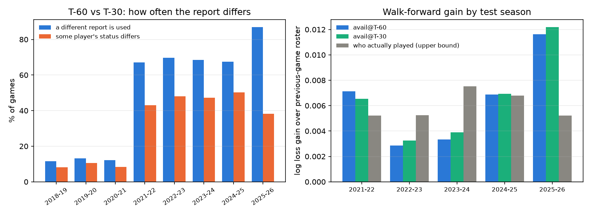

# Next season: injury reports, availability, and what else turned up

Written 2026-10-07 for Markus, as a record of the second build session (branch `next-season`). It follows
[player-model.md](player-model.md). The goal from the brief: the best honest model for 2026-27, with player availability as the
main new input, and a comparison of predicting at T-60, T-30 and T-15 minutes before tip-off.

## 1. The short version

- **The injury report is worth having, and it is worth about +0.0065 log loss.** Over five held-out seasons (6,072 games, walk-forward),
  a logistic regression whose team strength uses the report as it stood before tip-off beats the same model using the previous game's
  roster by +0.0065 (95% interval +0.0041 to +0.0089). All five seasons are positive (+0.003 to +0.012). It does as well as knowing who
  actually played (0.6056 against 0.6058).
- **The cutoff does not matter.** T-30 over T-60 is +0.0002 (interval -0.0006 to +0.0010); T-15 over T-30 is exactly zero. Between T-60 and
  T-30 a player's status changes in about 45% of games (hourly era), between T-30 and T-15 in 3% or less, but the late changes barely
  move a team rating. T-60 is as good as any later cutoff for this model.
- **The earlier idea that availability is the gap to the market is supported, with a caveat.** On the 680 games with stored prices the
  report-based model is within 0.005 log loss of the market (0.548 against 0.543); without the report it was 0.022 behind. But those stored
  prices were taken around 12:00 Helsinki (about 5 a.m. Eastern), hours before the afternoon reports, so the market was stale and the model
  had later news. A fair comparison needs prices near tip-off, which the live logger collects from now on.
- **No betting strategy has a chance with any of these models.** A Kelly sweep (5 fractions, 4 edge thresholds, 8 models) loses everywhere,
  and blending a model into the market price never helps unless the model knows who actually played.
- **Predicting the point margin or total points instead of win/loss does not help** (all within plus or minus 0.002 log loss of win-only).
- **Finnish basketball (Korisliiga, I and II divisioona) now has predictions** on the dashboard, from team results only.
- **Not done:** the live pipeline (box scores and ratings in the cloud, serving, shadow mode), the deep model with availability inputs,
  and scheduling the logger. They are listed in section 10.

## 2. What was built

| File | What it does |
|---|---|
| `research/live_logger.py` | Records ESPN injuries hourly and, at T-60, T-30 and T-15 before each game, the ESPN injury list, the newest official report and odds. Tested; not scheduled. |
| `research/injury_reports.py` | Parses the official PDFs (three layouts, rotated pages, wrapped cells) by word position. |
| `research/injury_download.py` | Downloads the archive at a polite rate with a canary check. |
| `research/injury_parse_all.py`, `injury_players.py` | Parses all 20,409 files; maps names to NBA player ids. |
| `research/injury_snapshots.py` | The report in force at T-60, T-30 and T-15 for every game. |
| `research/availability.py`, `availability_features.py` | P(plays), minutes forecast, availability-aware strength. |
| `research/availability_eval.py`, `availability_walkforward.py` | The comparisons in section 6. |
| `research/betting_sweep.py`, `margin_linear.py` | Kelly and market-blend analysis; linear margin check. |
| `research/finland/*` | Finnish results client, scraper and rating models (copied into the dashboard repo). |
| `src/predict_nba/utils/season.py`, edits to `data_collector.py`, `oddsfetcher.py` | The two production fixes of section 9. |

## 3. The official injury reports

The NBA publishes its injury report as PDFs at `ak-static.cms.nba.com/referee/injury/Injury-Report_<date>_<time>.pdf`. Teams must file the day
before by 5 p.m. local and update on game day, so the report is exactly the information a pre-game model can have. What probing showed:

- **They go back to 17 December 2018** and not before. There are none in the offseason or preseason.
- **The time in the file name is only a bucket.** The file named `05PM` holds the 5:30 PM report (2018 to November 2025); on 21 December 2025 the
  stamp was HH:45; from late December 2025 the reports are on a true 15-minute grid. Using the name as the time would leak half an hour of
  news, so everything uses the time printed inside the PDF.
- **The cadence changes, and that limits any cutoff comparison.** Three reports a day (1, 5 and 8 p.m. at :30) from 2018-19 to 2020-21, hourly at :30
  from 2021-22, quarter-hourly from late December 2025. The T-60/T-30/T-15 difference can only be measured where reports are frequent.
- **Three PDF layouts.** 2018-19 has Category and Previous Status columns; later reports list "Available" players too; older files are stored
  rotated by 90 degrees; wrapped reasons are vertically centred on their row (the first line sits *above* the player's line). The parser
  therefore maps words to the displayed orientation, takes column positions from the header row, anchors each row on its status word and
  attaches everything else to the nearest anchor. Found along the way: "NOT YET SUBMITTED" sits in the Reason column (Category in 2018-19), and
  four reports from 16-17 December 2019 merge status and reason in one cell.
- **Quality checks:** 2,188,652 rows from 20,409 files, no file errors. Only 0.67% of game blocks (2,008 of 300,018) do not match the schedule, and
  those are real non-games (All-Star weekend, the postponed Lakers-Clippers game of 28 January 2020). No row has a team that is not in its game.
  Name mapping reaches 99.49% of 90,297 unique (date, team, player) rows; the rest are mostly G League players who never appear in a box score.

## 4. At T-60, T-30 and T-15

For every game, the snapshot at a cutoff is the latest report filed at or before tip-off minus the cutoff that lists the game. Tip-off comes from
the reports themselves (the Eastern time printed with each game).

Left: how often a different report is used and how often some player's status differs between T-60 and T-30. In the hourly years the
report differs for about 68% of games and some status for 43 to 50%; in the three-a-day years it is 12% and 8 to 10%. Between T-30 and T-15 the
chosen report is identical in the hourly years, because reports come at :30, and in 2025-26 a status changes in only 3% of games.

## 5. From a report to a team strength

1. **Who might play.** The previous game's ten main players plus everyone the report lists (a star who missed the last game and is "Probable"
   tonight is on the report but not in the previous roster).
2. **P(plays).** For listed players, the share who actually played by status and reason group, fitted on 2019-20 to 2023-24:
   Out 0.1%, Doubtful about 2%, Questionable about 53%, Probable about 90%, Available with an injury about 91%. The figures hold on validation and
   test (Questionable: 0.525, 0.50, 0.55). A one-variable adjustment for expected minutes gives log loss 0.099, 0.088 and 0.078 on train, validation
   and test. For unlisted players, a logistic regression on expected minutes (94% play).
3. **Minutes.** Expected minutes times P(plays). Forecast error per candidate, validation and test: 5.59 and 5.56 minutes for the previous-roster
   baseline, **4.04 and 3.99 with P(plays)**, 4.24 and 4.19 when also redistributing absent players' minutes to teammates. Redistribution adds nothing,
   which makes sense because the strength weights are normalised to the team's total anyway.
4. **Strength.** The sum over candidates of (5 x minutes / total minutes) x rating, with each player's Elo and ridge plus-minus rating as it stood
   before the game (from the first report's rating work).

## 6. Results

All models are logistic regressions on a handful of numbers (team Elo, player Elo and ridge strength, rest and back-to-back, plus minutes lost
to absences for the availability versions), so differences come from the information. Walk-forward: for each test season from 2021-22 to 2025-26, fit on
the seasons before the previous one, choose the regularisation on the previous one, score the test season once.

| Pooled over 6,072 games | Log loss | Accuracy | Gain over previous roster, 95% interval |
|---|---|---|---|
| Previous-game roster (no report) | 0.6119 | 66.5% | |
| With the report at T-60 | 0.6056 | 66.6% | +0.0063 [+0.0038, +0.0087] |
| With the report at T-30 | 0.6054 | 66.4% | +0.0065 [+0.0041, +0.0089] |
| With the report at T-15 | 0.6054 | 66.4% | +0.0065 [+0.0041, +0.0089] |
| Who actually played (not available live) | 0.6058 | 66.7% | +0.0060 [+0.0036, +0.0084] |

Per season, the gain of the T-60 version over the previous roster: +0.0071, +0.0029, +0.0033, +0.0069, +0.0116 (2021-22 to 2025-26).
The last season was the best, as it was for the rating models in the first report. Cutoff comparison: T-30 over T-60 +0.0002 [-0.0006, +0.0010];
T-15 over T-30 +0.0000 [-0.0001, +0.0001].

On the single held-out seasons of the first report's split, the gain was larger on the test season (+0.0120 for T-30, interval +0.0061 to +0.0175)
than on validation (+0.0073), so the walk-forward figure is the one to quote. Against the market, on the 680 priced games, the previous-roster model was
0.0224 behind (0.5655 against 0.5432); with the report it was 0.0065 (T-60), 0.0048 (T-30) and 0.0050 (T-15) behind. As said in section 1, those prices are
stale (about 5 a.m. Eastern), so this is not a fair test of beating the market.

## 7. The other questions from this session

- **Margin or points instead of win/loss.** The same networks trained on margin only, win plus margin, and win plus margin plus total points: test log loss
  within plus or minus 0.002 of win-only for both encoder families, below seed noise. A linear check (ridge on margin, turned into a probability, against
  logistic regression on win/loss) is also a tie, 0.5921 against 0.5912.
- **Kelly with different fractions.** Final bankroll below 1.00 for every fair model at every fraction from 0.05 to 1.0 and edge threshold from 0% to 10%.
  The best, the earlier Deep Sets, ends at 1.02 at k=0.05. The reason is visible in the edge calibration: bets the logistic regression rated at 20% or more
  edge had model probability 0.40, market probability 0.26 and an actual win rate of 0.26. The models are less sharp than the market, so their "positive
  expected value" bets are mostly underdogs, and underdogs lose.
- **Does a model add anything to the market?** Blending a model into the de-vigged price (weight fitted on half the games, scored on the other half): the
  weight is near zero or negative for every fair model, with no meaningful gain. The model that knows who really played gets a weight near +0.5 in both
  directions and improves on the stale price (0.4671 against 0.4700; 0.6129 against 0.6163).
- **How many bets to confirm an edge?** About 35,000 for a 1% ROI (rough calculation from a published guide), so 680 games can only rule out large edges.

## 8. Finnish basketball

Predictions for Korisliiga and I divisioona A and B in one rating model, and II divisioona (M2D) in another, team results only; on the dashboard
under "Finland". Data from the Finnish Basketball Association's results service (a JSON API behind tulospalvelu.basket.fi, using the client key that
page's own JavaScript hands to every browser, read at run time and stored nowhere; one request a second, cached). 3,865 men's matches over five seasons,
with all four quarter scores for 95 to 100% of them. Two rating families (Elo with a margin multiplier, and a margin rating where a team's rating is
its expected point margin) times four ways of measuring the margin from the quarter scores (final, after three quarters, halftime, mix), tuned on 2023-24
and 2024-25, scored once on 2025-26. Result: national 65.5% of games called right (563 games), log loss 0.606 against 0.684 for the home-win-rate baseline;
M2D 63.9% (241 games), 0.591 against 0.689. The families and margin definitions are within noise of each other. Season carryover goes towards the level
of the league a team last played in, so an I divisioona team cannot drift above Korisliiga teams. A test confirms that changing later results leaves
earlier predictions unchanged. The page also follows Aalto-Basket with a star and its own card (rated 4th of 24 in M2D). No bookmaker prices exist for
these leagues in the odds provider used here.

## 9. Mistakes, bugs and fixes

| What | How found | Fix |
|---|---|---|
| The first downloader got this PC blocked for about 15 minutes, and recorded the refusals as "missing" | Only 37 files found in 4,900 probes, none after January 2019, although spot checks had found files from 2019 to 2021; then known files returned 403 | Purged the false entries (kept a copy); 2 requests a second; a canary file is fetched before any batch is recorded, and the run waits if it fails; per-month cadence discovery so far fewer probes are needed |
| File names taken as report times | The `05PM` file's header said 5:30 PM on every date | Always use the time inside the PDF |
| Pages without a header row (all pages after the first in newer reports) were skipped | 15 rows parsed from a 161-row report | Carry the column positions from the previous page |
| Team names above "NOT YET SUBMITTED" attached to the wrong row | Combined team text such as "Cleveland Cavaliers Indiana Pacers" | Block-level cells attach to the latest one at or above the row |
| "NOT YET SUBMITTED" found in zero reports | Zero count in files that visibly contained it | It sits in the Reason or Category column, not Team |
| Status and reason merged in four December 2019 reports | 126 rows with status "Available -" | `split_status` in the parser and when loading |
| The odds API has no games in preseason, so the production job's odds table is empty and the job raises `KeyError('home_team')` and drops the day | The API's earliest listing was 20 October; reproduced the exact expression | `OddsFetcher` always returns its four columns; tested |
| The season was hardcoded to 2025-26 in the production collector | Reading the code | Derived from the date (`utils/season.py`); tested |
| An earlier run overwrote a deep-learning iteration log | The file held 4 entries instead of 12 | Console logs kept; the code appends |
| Thinking the Finnish API data was corrupted ("Kipin?") | The characters printed wrongly | The JSON was correct (escaped); only the terminal display was off |

## 10. What this means for next season, and what is not done

- **The model to carry forward** is the rating model with availability, not a bigger network. The first report found that about three rating numbers carry most
  of the signal, and this session found that the report adds a further, reliable +0.0065. T-60 is a sufficient cutoff, which gives time for processing.
- **Not done: the live pipeline.** Ratings need each player's recent box scores. Training used `stats.nba.com` through `nba_api`, which is reported to block cloud
  addresses (not verified for Fly.io); ESPN box scores work from the cloud. Either backfill ratings from ESPN data too, or prove the two sources agree on a sample, and
  run the post-game update job. Also needed: the report parser in production, the P(plays) table, the logger scheduled, closing odds logged for a fair market comparison,
  and shadow mode next to the current model. Where the logger runs is Markus's decision, and it needs to be running before 19 October.
- **Not tried:** the deep model with availability inputs (the linear model already captures the gain, and the deep models added only 0.005 to 0.008 over such a model
  in the first report), gradient-boosted trees, player and foul statistics for Finnish leagues, spectral features.
- **Cautions:** every number is on one provider's data and a handful of seasons; the report-time cadence differs across the years; the walk-forward gain varies by season
  (0.003 to 0.012); the market comparison is not yet fair.

## 11. What to be able to defend

1. Why report header times, not file names, and how that was found.
2. Why a walk-forward over five seasons rather than one test season, and what it showed (+0.0065, not +0.012).
3. Why the cutoff comparison has a limited resolution (the cadence changed) and what a null result there means.
4. Why the market comparison here is not a fair one, and how the live logger fixes that.
5. Why a model that is worse than the market loses under any staking rule, in your own words, using the edge-calibration table.
6. The download incident: what went wrong, why recording "missing" was dangerous, and what the canary prevents.
7. Why the Finnish model is judged against the home-win rate and not a market, and why its results are noisier (few teams, few games).

## 12. Decisions made without asking

- Availability features enter a small logistic regression, not a new network, so the comparison isolates the information.
- Odds are taken at T-60 and T-15 only, to stay inside the 500-call monthly quota.
- Margin and total-points targets were tested and dropped.
- The Finnish pipeline lives in the dashboard repository so the daily build can refresh it; the research copy stays here.
- Aalto-Basket is marked on the Finland page (easy to remove: set `FOCUS_TEAM = None`).
- Commits have plain messages with no attribution trailer, as asked.
